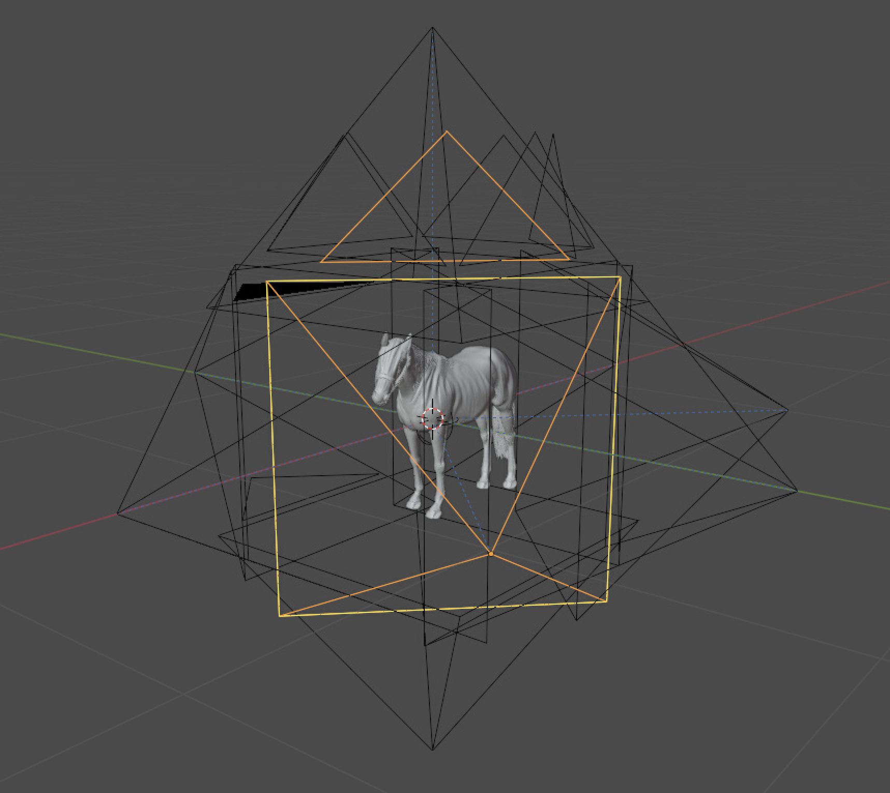

# blender_cam_novelviews

A Blender add-on that recreates the **Hunyuan3D MultiView** camera rig, matching the exact viewpoints used by `Hy3DRenderMultiView` in ComfyUI. Can add different camera positions but these are the most common ones. Can be used for retxturing using depth/normals/position maps.

